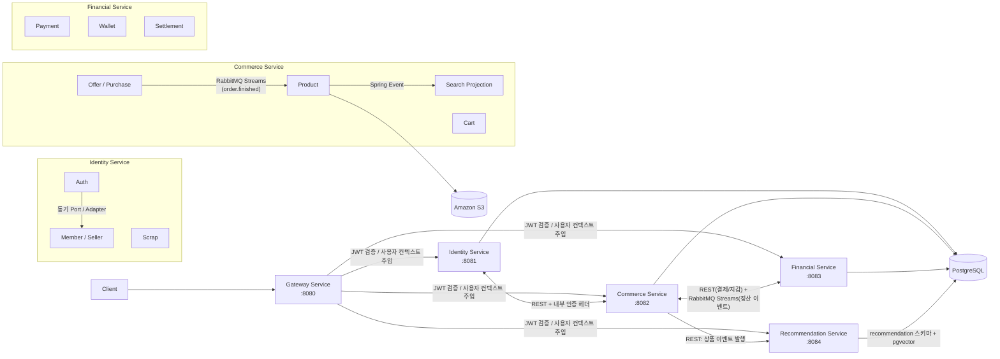

<div align="center">


단순한 가격 경쟁이 아닌, 판매자의 스토리를 통해 상품의 가치를 전달하고 <br>
그 가치를 중심으로 거래가 이루어지는 스토리텔링형 한정판 거래 플랫폼입니다.

</div>

<hr>

## 목차
- [Stack](#stack)
- [프로젝트 구조](#프로젝트-구조)
- [주요 기능 소개](#-주요-기능-소개)
- [시스템 아키텍처](#시스템-아키텍처)
- [실행 가이드](#실행-가이드)
- [팀원](#팀원)

<hr>

## Stack

**Language**
<br>


**Framework**
<br>


**Build Tool**
<br>


**Database**
<br>


**Auth**
<br>


**Infra**
<br>


**Test**
<br>


**Tools**
<br>


---


## 프로젝트 구조

해당 프로젝트는 멀티모듈 기반으로 구성하였으며, DDD 4계층 구조(Presentation / Application / Domain / Infrastructure)를 적용하였습니다.

### 💡 설계 의도 및 도입 배경

**멀티 모듈** : 도메인 간 결합도를 낮추고 영향 범위를 모듈 단위로 제한하여, 로직 변경이나 신규 기능 추가 시 사이드 이펙트를 최소화하고자 도입하였습니다. 또한 특정 도메인에 트래픽이 집중될 경우 해당 서비스만 선택적으로 `Scale-out` 할 수 있도록, 향후 MSA로의 전환 및 분리가 용이한 구조를 설계하였습니다.

**DDD 아키텍처** : 계층 간 관심사를 명확히 분리하고 도메인 로직을 한곳으로 응집시켜, 비즈니스 정책 변경으로 인한 수정 범위를 최소화하고자 도입하였습니다. 또한 외부 인프라 변경이 메인 비즈니스에 영향을 미치지 않는 구조를 설계하였습니다.

```
dear
├── common                          # 공통 모듈
│   └── common-web                  # API 응답 포맷, 인증(@AuthUser), 예외 처리, 내부 API 클라이언트
│   └── common-jpa                  # JPA 공통 설정 (BaseEntity 감사 컬럼)
│   └── common-monitoring           # Actuator, Prometheus 메트릭
│   └── common-messaging            # RabbitMQ Streams 발행 · 구독 공통 인프라
├── gateway-service                 # API Gateway (Spring Cloud Gateway)
├── identity-service                # 인증 · 회원 서비스
│   └── shop.dear.identity
│       ├── auth
│       │   ├── authentication      # 로그인 / 토큰 발급
│       │   └── authorization       # 인가
│       ├── member                  # 회원 · 판매자
│       └── scrap                   # 스크랩
├── commerce-service                # 상품 · 검색 · 장바구니 · 주문 서비스
│   └── shop.dear.commerce
│       ├── product                 # 상품
│       ├── search                  # 검색
│       ├── cart                    # 장바구니
│       └── order
│           ├── offer               # 오퍼(제안)
│           ├── offersnapshot       # 오퍼 스냅샷
│           └── purchase            # 구매
├── financial-service               # 결제 · 정산 · 예치금 서비스
│   └── shop.dear.commerce.financial
│       ├── payment                 # 결제
│       ├── settlement              # 정산
│       ├── settlementpolicy        # 정산 정책
│       └── wallet                  # 예치금
└── recommendation-service          # 추천 서비스 (상품 임베딩 기반 유사상품 추천 + 사용자 행동 기반 추천)
    └── shop.dear.recommendation
        └── behavior                # 행동 이벤트 수집 · 관심사 계산 · 기본 추천
```

<hr>

## 🛍️ 주요 기능 소개

### 👥 공통 기능 (모든 사용자)

* **회원 관리:** 이메일 및 비밀번호를 통한 회원가입, 로그인/로그아웃, 회원 탈퇴


* **프로필 관리:** 내 프로필 조회 및 수정 (닉네임, 배송지, 전화번호)


* **상품 탐색:**
  * 상품 목록 및 상세 조회
  * 카테고리, 상품명, 스토리 기반 검색
  * 최신순, 인기순, 가격순 정렬


* **한정판 상품:** 매일 저녁 8시에 당일 등록된 한정판 상품 공개


* **스크랩:** 관심 상품 찜하기 및 찜 목록 조회, 찜 해제


* **추천 시스템:** 사용자와 비슷한 취향의 상품 및 최근 관심사 기반 상품 추천


* **예치금 관리:** 예치금 충전, 잔액 조회

---

### 🛒 구매자 기능

* **주문 및 결제:**
  * **즉시 구매:** 상품의 금액으로 즉시 구매 신청 후 5분 내 결제 진행 (구매 확정 또는 취소)
  * **오퍼 제안:** 원하는 상품의 판매자에게 오퍼를 제안하고 수락/거절 여부 확인 (수락 시 결제 진행)


* **장바구니:** 상품 담기, 선택 삭제 및 전체 비우기, 담은 상품 목록 조회


* **구매 이력:** 진행 중인 주문 및 완료된 구매 내역 조회

---

### 📦 판매자 기능

* **판매자 관리:** 판매자 등록(정산 계좌), 판매자 해지, 정보 수정(정산 계좌)


* **상품 등록 및 관리:**
  * 한정판 상품 등록 (사진과 스토리를 통한 상품 가치 소개)
  * 등록한 상품 수정 및 삭제
  * 등록 상품 목록 조회


* **오퍼 제안 관리:** 구매자의 오퍼 제안 확인 및 수락/거절 (수락 시 동일 상품의 다른 제안 자동 정리)


* **정산 관리:** 판매 완료 건에 대한 정산 예정 금액 및 정산 이력 조회, 월별 정산대금 수령


---


## 시스템 아키텍처



### 실행 단위

| 모듈 | 포트 | 역할 |
| --- | --- | --- |
| `gateway-service` | 8080 | 외부 요청 라우팅, JWT 검증, 인증 사용자 헤더 주입 |
| `identity-service` | 8081 | 인증 계정, 회원 프로필, 판매자, 스크랩 관리 |
| `commerce-service` | 8082 | 상품, 검색, 장바구니, 오퍼, 즉시 구매 |
| `financial-service` | 8083 | 결제, 지갑(예치금), 정산 |
| `recommendation-service` | 8084 | 상품 추천, 사용자 행동 로그, 벡터 유사도 검색 |
| `common` | - | 공통 응답, 예외, 인증 컨텍스트, 이벤트 계약 |


### 구조적 특징 및 통신 방식
* **데이터베이스 공유**: 현재 구조는 완전한 형태의 MSA는 아니며, 5개의 Spring Boot 애플리케이션이 각각 독립 실행되고 Identity·Commerce·Financial·Recommendation 서비스는 하나의 PostgreSQL 인스턴스를 공유합니다.


* **서비스 간 통신**:
  * **동기 통신**: REST API (`/internal/**`) 활용
  * **비동기 통신**:
    - Spring Events를 통한 이벤트 발행 및 구독 처리
    - RabbitMQ Streams 메시지 브로커를 통한 이벤트 발행 및 구독 처리


### 📡 서비스 간 통신 및 설계 의도

**REST API (동기 통신)**
* **적용 대상:** 도메인 간 통신 중 즉각적인 응답과 결과 확인이 필수적인 구간
* **의도:** 명확한 요청과 응답이 보장되어야 하는 비즈니스 로직에 활용합니다.


**Spring Events (비동기 내부 통신)**
* **적용 대상:** 도메인 간 결합도를 낮추고 격리가 필요한 구간
* **의도:** 통신 대상 도메인의 장애로 인해 서비스의 스레드가 응답 없이 무한 대기(블로킹)에 빠지는 현상을 차단하고 장애 전파를 방지합니다. 이를 통해 결과적 일관성을 보장합니다.


**RabbitMQ Streams (비동기 외부 메시지 브로커)**
* **적용 대상:** 하나의 이벤트를 구독해야 하는 컨슈머(도메인)가 많은 특정 이벤트 (ex. '주문 완료')
* **의도:** 이벤트 발행자가 수많은 컨슈머들을 일일이 알거나 직접 전달해야 하는 구조적 한계와 높은 결합도 문제를 해결합니다. 이벤트 발행 도메인은 오직 **이벤트 발행에만 집중**하고, 각 컨슈머들이 메시지 브로커로부터 필요한 이벤트를 직접 구독해 갈 수 있도록 설계하여 확장성을 높였습니다.


---


## 실행 가이드

### 사전 요구사항

- Java 21
- Docker

### 1. 인프라 실행

**[ PostgreSQL ]**
```bash
docker compose \
  -f common/docker/local_postgres/docker-compose.local.yaml \
  up -d
```

- PostgreSQL 로컬 기본값 <br>
```
DB_DRIVER = org.postgresql.Driver
DB_URL = jdbc:postgresql://localhost:5432/dear
DB_USERNAME = root
DB_PASSWORD = root
```

**[ RabbitMQ ]** — commerce-service, financial-service의 이벤트 발행/구독(RabbitMQ Streams)에 필요합니다.
```bash
docker compose \
  -f common/docker/rabbitmq/docker-compose.local.yaml \
  up -d
```
- 로컬 기본 계정: `dear` / `dear`
- 관리 콘솔: http://localhost:15672

**[ Elasticsearch ]** — commerce-service의 검색 기능에 필요합니다.
```bash
docker compose \
  -f common/docker/elasticsearch/docker-compose.local.yaml \
  up -d
```

**[ Ollama ]** — recommendation-service의 상품 임베딩(유사 상품 추천)에 필요합니다.
```bash
docker compose \
  -f common/docker/ollama/docker-compose.local.yaml \
  up -d
```
- 최초 1회, 임베딩 모델을 받아둬야 합니다
```bash
docker exec ollama-local ollama pull bge-m3
```

### 2. 서비스 실행
각 명령을 별도 터미널에서 실행합니다. <br>
모든 API는 Gateway의 `http://localhost:8080/api/*`를 통해 호출합니다.
회원가입, 로그인, 상품 목록, 검색은 공개 경로이며, 그 외 경로는 Bearer Access Token이 필요합니다.

**[ 회원 서비스 실행 ]**
```bash
./gradlew :identity-service:bootRun
```

**[ 커머스 서비스 실행 ]**
```bash
./gradlew :commerce-service:bootRun
```

**[ 결제 서비스 실행 ]**
```bash
./gradlew :financial-service:bootRun
```

**[ 추천 서비스 실행 ]**
```bash
./gradlew :recommendation-service:bootRun
```

**[ 게이트웨이 서비스 실행 ]**
```bash
./gradlew :gateway-service:bootRun
```


---


## 팀원
 이름 | 깃허브 아이디      |
| --- |--------------|
|김세하|	@aio19581|
|김진범|	@bum0w0|
|김태우|	@KAITOKIDDA|
|양화영|	@sanchaehwa|
|유도훈|	@phdcoco|
|황서은|	@Hwangseoeun|
